<p align="center">
  <picture>
    <source media="(prefers-color-scheme: dark)" srcset="LabImporter/Assets.xcassets/AppIcon.appiconset/AppIcon-dark.png">
    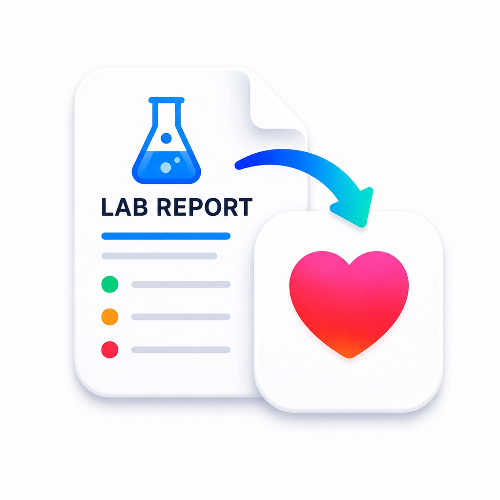
  </picture>
</p>

<h1 align="center">LabImporter</h1>

<p align="center">A native iOS app that imports lab report values into Apple Health using on-device AI.</p>

Scan, import, or paste your lab report — the app uses Vision OCR and the on-device Foundation Models framework to extract values, lets you review and correct them, then saves them directly into Apple Health as a CDA clinical document.

Because the parsing runs on Apple Intelligence, LabImporter needs a compatible device: an **iPhone 15 Pro, iPhone 16, or newer**, or an **iPad with Apple silicon (M1 or later)**, running **iOS or iPadOS 26.0 or later**.

> [!IMPORTANT]
> **Not medical advice.** LabImporter is not a medical device and does not provide medical advice, diagnosis, or treatment. Extracted values may be inaccurate or incomplete — always verify them against your original report and never make medical decisions based on this app. See the [Medical disclaimer](#medical-disclaimer) below.

---

## Screenshots

| | Light | Dark |
|---|---|---|
| **Dashboard** — metric cards with sparklines | 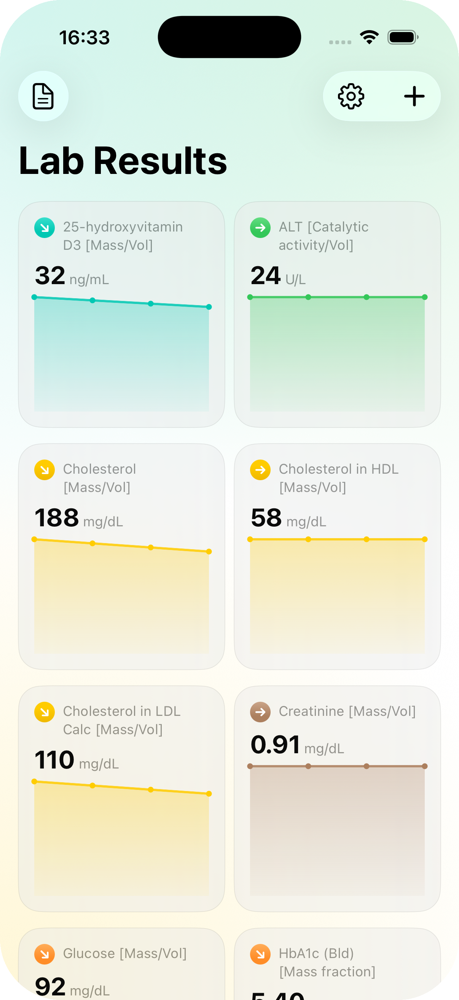 | 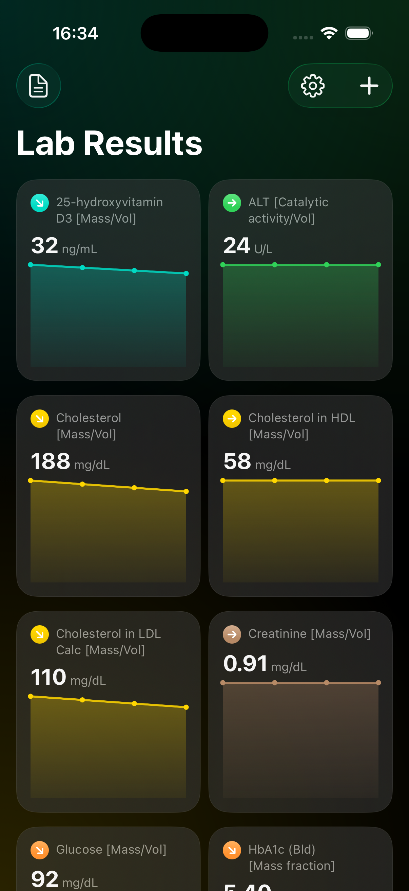 |
| **Trends** — interactive per-metric chart | 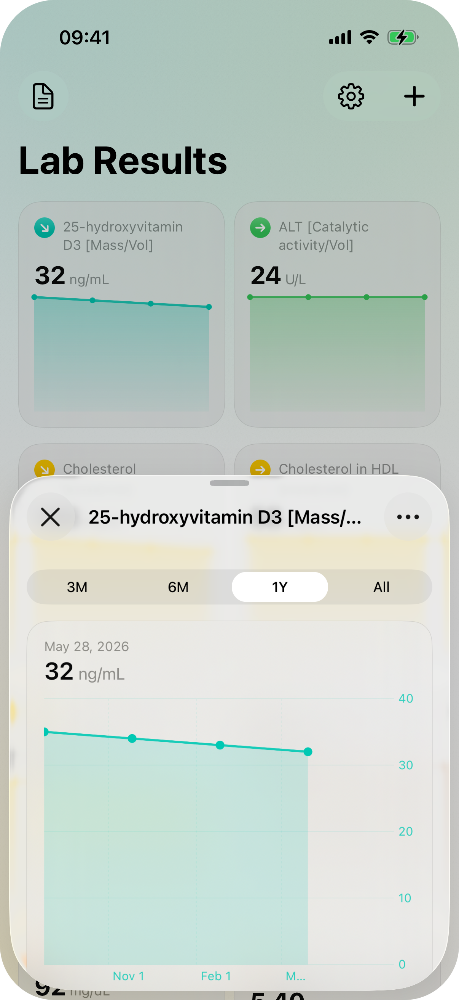 | 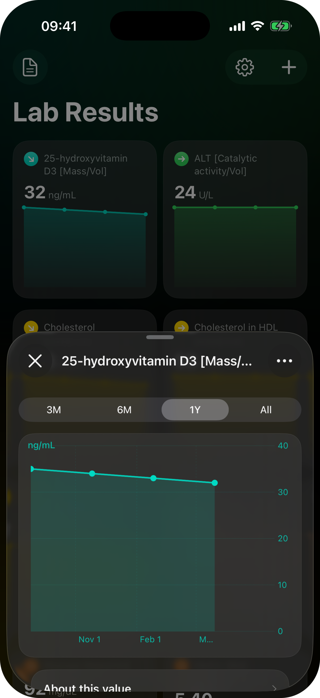 |
| **Review** — AI-extracted values before saving | 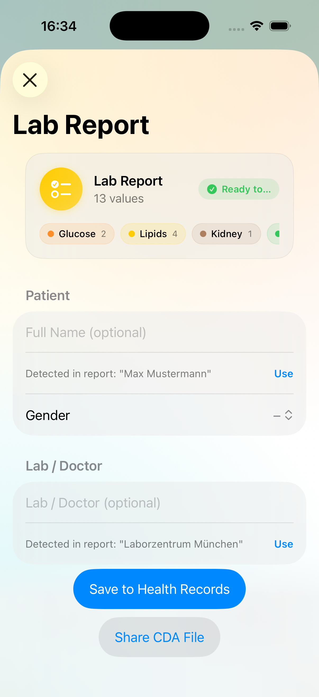 | 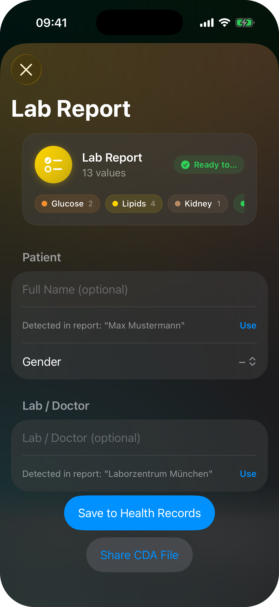 |
| **Reports** — full import history by year | 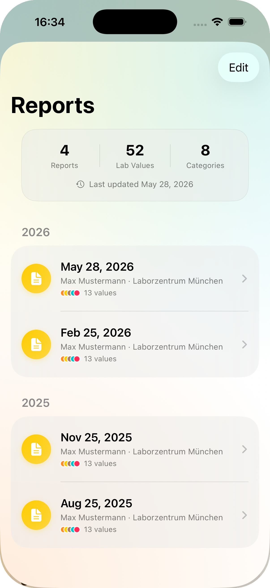 | 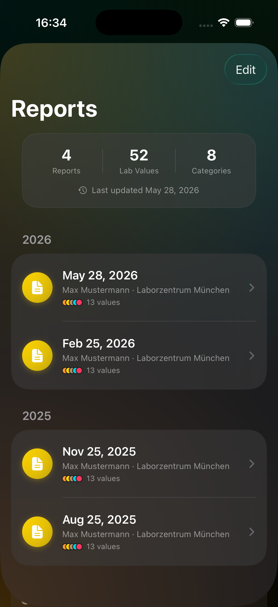 |
| **Settings** — sort, sync, and LOINC catalog | 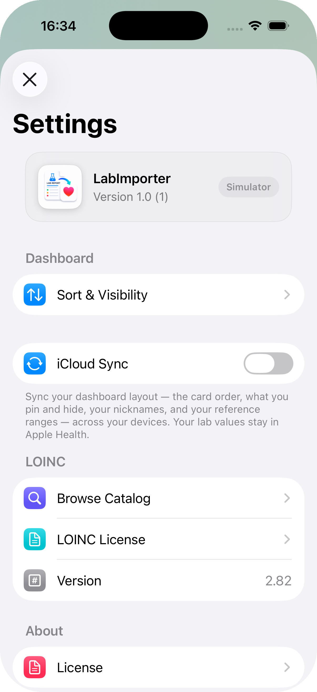 | 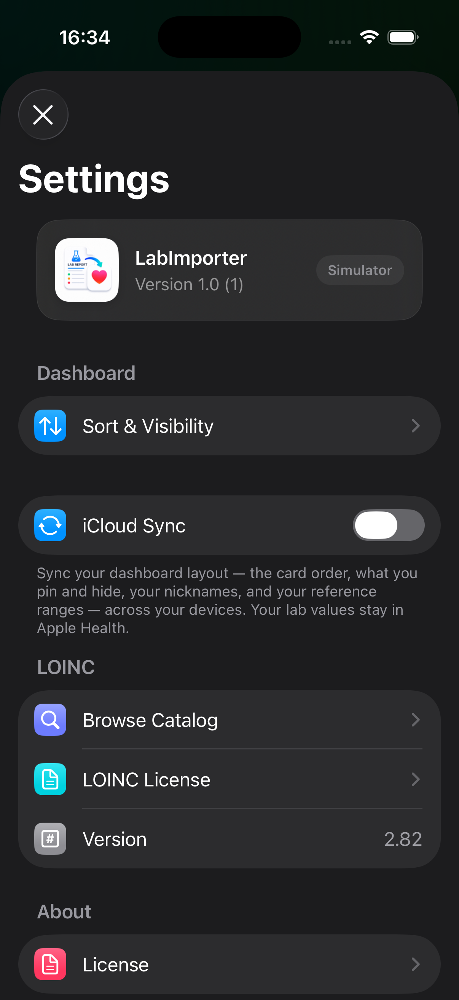 |
| **PDF Export** — pick sections, range, and values | 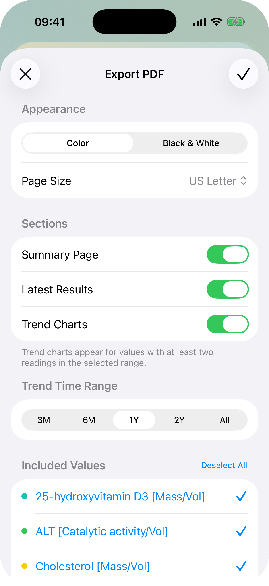 | 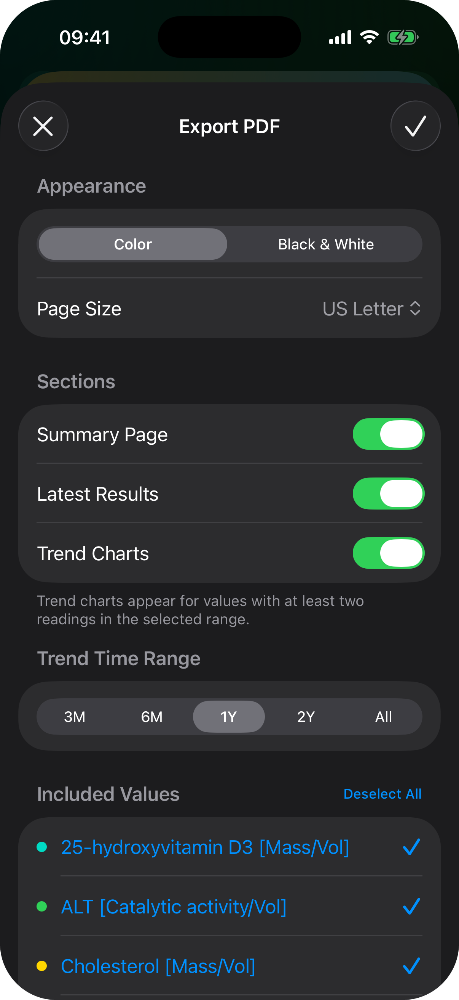 |

---

## Features

- **Import** by scanning multi-page documents with the camera, picking PDFs or images from Files, pasting from the clipboard, or sending a PDF/image to LabImporter from any app via the share sheet ("Open With")
- **On-device AI parsing** — Foundation Models + Vision OCR extract lab values without sending any data to a server
- **Review & correct** — edit values, change codes, add or remove entries before saving
- **Dashboard** — metric cards with current value, sparkline, and a trend-direction indicator (rising / falling / steady)
- **Trend charts** — interactive per-metric chart with finger-scrubbing to inspect individual values
- **History** — full list of imported reports with edit and delete
- **Customise** — pin metrics to the top, reorder, or hide them from the dashboard
- **iCloud sync (opt-in)** — optionally roam your dashboard layout (card order, pins, hidden metrics, custom names, and reference ranges) across your devices; your lab values always stay in Apple Health and never sync
- **Share** — export any report as a CDA file to send to a doctor or another app
- **PDF export** — generate an information-rich PDF report (cover summary, latest-results table, and trend charts), choosing which values and time range to include, in color or black & white, on A4, US Letter, or Legal paper (defaulting to your region's size)
- **25 languages** — fully localized in 🇧🇬 Bulgarian · 🏴󠁥󠁳󠁣󠁴󠁿 Catalan · 🇭🇷 Croatian · 🇨🇿 Czech · 🇩🇰 Danish · 🇳🇱 Dutch · 🇬🇧 English · 🇫🇮 Finnish · 🇫🇷 French · 🇩🇪 German · 🇬🇷 Greek · 🇭🇺 Hungarian · 🇮🇹 Italian · 🇯🇵 Japanese · 🇵🇱 Polish · 🇧🇷 Portuguese (Brazil) · 🇵🇹 Portuguese (Portugal) · 🇷🇴 Romanian · 🇷🇺 Russian · 🇨🇳 Simplified Chinese · 🇸🇰 Slovak · 🇪🇸 Spanish · 🇸🇪 Swedish · 🇹🇷 Turkish · 🇺🇦 Ukrainian
- **Privacy-first** — all data lives in Apple Health on your device; no account or server required

---

## Requirements

- iOS or iPadOS 26.0 or later
- An Apple Intelligence–capable device:
  - **iPhone 15 Pro, iPhone 16, or newer**, or
  - **iPad** with Apple silicon (M1 or later)
- An Apple Developer account (free tier is sufficient for personal use via Xcode)
- For GitHub Actions builds: an Apple Developer Program membership (paid, required for TestFlight)

---

## Building with GitHub Actions (no Mac required)

This repository uses Fastlane + Fastlane Match for fully automated, Mac-free builds.

### Required secrets

Add these to your repository (or organisation) under **Settings → Secrets and variables → Actions**:

| Secret | Description |
|---|---|
| `GH_PAT` | GitHub Personal Access Token with **repo** and **workflow** scopes — used to access the `Match-Secrets` repository |
| `TEAMID` | Your 10-character Apple Developer Team ID (found at [developer.apple.com/account](https://developer.apple.com/account)) |
| `FASTLANE_ISSUER_ID` | App Store Connect API key Issuer ID (UUID) |
| `FASTLANE_KEY_ID` | App Store Connect API key ID (10 characters) |
| `FASTLANE_KEY` | App Store Connect API key contents (the `.p8` file, paste the full text including header/footer) |
| `MATCH_PASSWORD` | A strong password used to encrypt certificates in the `Match-Secrets` repository |

> Secrets can be set at the organisation level — if they are already configured there you have nothing extra to do.

### Optional repository variables

Set these under **Settings → Secrets and variables → Actions → Variables**:

| Variable | Value | Effect |
|---|---|---|
| `ENABLE_NUKE_CERTS` | `true` | Allow automatic certificate renewal when the Distribution cert expires |
| `FORCE_NUKE_CERTS` | `true` | Immediately revoke and recreate all Distribution certificates |

### First-time setup (run once, in order)

#### 1. Validate Secrets

Go to **Actions → 1. Validate Secrets → Run workflow**.

This checks that all secrets are valid, that your App Store Connect API key works, and creates the private `Match-Secrets` repository in your GitHub account if it does not already exist.

#### 2. Add Identifiers

Go to **Actions → 2. Add Identifiers → Run workflow**.

This registers your app's bundle ID in App Store Connect and enables the **HealthKit** and **iCloud (key-value storage)** capabilities on it. The iCloud capability backs the opt-in dashboard-layout sync; if you enable it after a profile already exists, re-run **3. Create Certificates** (with `ENABLE_NUKE_CERTS` or `FORCE_NUKE_CERTS` set) so the provisioning profile is regenerated to include it.

The bundle identifier is `dev.idoodler.<TEAMID>.labimporter`. The `<TEAMID>` placeholder is substituted automatically from the `TEAMID` secret at build time via `Config.xcconfig`.

After this step, go to [App Store Connect](https://appstoreconnect.apple.com) and create a new app record for **LabImporter** using the bundle ID shown in the workflow log. This is required before the first build can upload to TestFlight.

#### 3. Create Certificates

Go to **Actions → 3. Create Certificates → Run workflow**.

This generates the Distribution certificate and provisioning profile and stores them encrypted in the `Match-Secrets` repository.

#### 4. Build LabImporter

Go to **Actions → 4. Build LabImporter → Run workflow**.

This runs on a GitHub-hosted `macos-26` runner with Xcode 26.2, builds and archives the app, increments the build number automatically from the latest TestFlight build, and uploads the IPA to TestFlight.

After the first manual run succeeds, builds are triggered automatically on the **first Sunday of each month**.

---

## Building locally with Xcode

1. Clone the repository:
   ```
   git clone https://github.com/idoodler-s-Diabetes-Management/LabImporter.git
   ```

2. Open `LabImporter.xcodeproj` in Xcode 17 or later (requires the iOS 26 SDK).

3. Configure code signing by creating a `Local.xcconfig` file next to `Config.xcconfig` at the repo root:

   ```
   DEVELOPMENT_TEAM = YOUR_TEAM_ID
   CODE_SIGN_STYLE = Automatic
   ```

   Replace `YOUR_TEAM_ID` with your 10-character Apple Developer Team ID (from [developer.apple.com/account](https://developer.apple.com/account)). `Config.xcconfig` includes this file via `#include?`, so the team and bundle identifier resolve automatically. `Local.xcconfig` is gitignored — keep it out of the Xcode project (the include works purely on the file path) so your Team ID never lands in commits.

4. Build and run on a connected device or simulator (iOS 26+).

> **Note:** The on-device Foundation Models framework requires a physical device with Apple Intelligence support. On unsupported hardware the app shows a "Device Not Supported" screen, since lab value parsing depends entirely on the on-device model.

---

## How it works

| Step | Technology |
|---|---|
| Document input | `VisionKit` document scanner (multi-page), `UIDocumentPicker` for PDFs / images, Clipboard, or files opened from other apps (`CFBundleDocumentTypes` + `onOpenURL`) |
| PDF rendering | `PDFKit` — extracts embedded text or renders pages for OCR |
| Text extraction | `Vision` — `VNRecognizeTextRequest` (app's current language + English fallback) |
| Lab value parsing | `FoundationModels` — `@Generable` structured output via `LanguageModelSession` |
| Health import | `HealthKit` — `HKCDADocumentSample` (CDA R2 clinical document) |

---

## iCloud sync

iCloud sync is **opt-in** and **layout-only**. On first launch — after the welcome and Apple Health steps — onboarding asks you to make an explicit choice before you can add any reports; you can change it later under **Settings → iCloud Sync**.

When enabled, only your **dashboard layout** roams across your devices through your private iCloud key-value store (`NSUbiquitousKeyValueStore`): the card order, which metrics are pinned, which are hidden, any custom names (nicknames) you've given metrics, and any custom reference ranges you've set. That's the entire payload.

**Your lab values never sync.** They live exclusively in Apple Health, and patient metadata (name, date of birth, biological sex) stays on the device it was entered on. No lab data is ever transmitted, with or without sync enabled.

---

## Privacy

All processing happens entirely on-device. No lab data is sent to any server. The Foundation Models framework runs the language model locally without any network requests. The optional [iCloud sync](#icloud-sync) carries only your dashboard layout — never lab values or patient metadata.

---

## AI Disclosure

### On-device AI inside the app

Lab value extraction is powered by Apple's on-device Foundation Models framework (`LanguageModelSession` / `@Generable`). The language model runs entirely on the device — no lab data is transmitted to any external server or API. An Apple Intelligence-capable device (iPhone 15 Pro, iPhone 16, or newer, or an iPad with Apple silicon, on iOS / iPadOS 26+) is required for parsing; on unsupported hardware the app shows a "Device Not Supported" screen.

### Built with AI assistance

This app was designed and built with the assistance of [Claude Code](https://claude.ai/code) by Anthropic. AI-assisted development was used throughout: app architecture, Swift/SwiftUI implementation, HealthKit and CDA integration, on-device model prompting, and the dashboard, trends, and history features.

---

## Medical disclaimer

LabImporter is **not a medical device** and does **not** provide medical advice, diagnosis, or treatment. It is a convenience tool for importing and visualising your own lab values.

Values are extracted automatically — including by on-device AI and OCR — and may be **inaccurate or incomplete**. Always verify every value against your original lab report before relying on it. **Never make medical decisions based on this app.** For any questions about your results, consult a qualified healthcare professional.

The software is provided "as is", without warranty of any kind, as described in the [LICENSE](LICENSE).

---

## Support

LabImporter is free and open source. If you find it useful, you can support its development:

<a href="https://liberapay.com/idoodler/donate" target="_blank"></a>

[liberapay.com/idoodler](https://liberapay.com/idoodler/donate)

---

## License

This project is licensed under the MIT License — see the [LICENSE](LICENSE) file for details.
